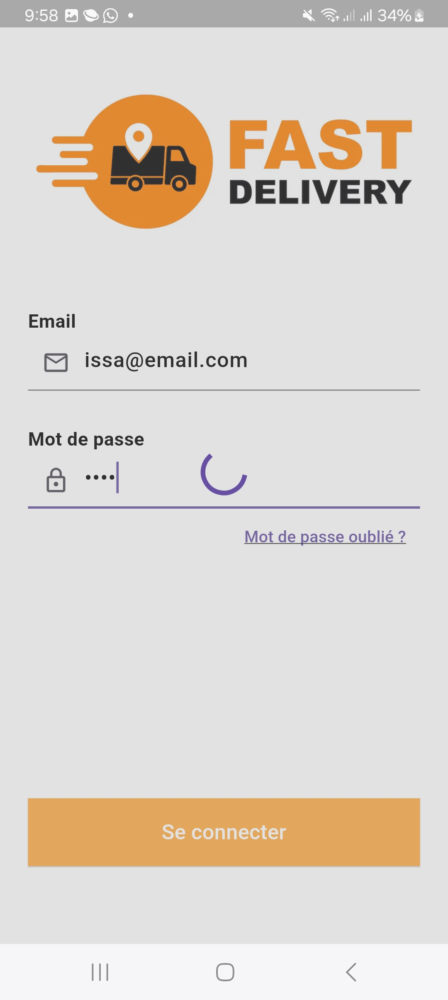
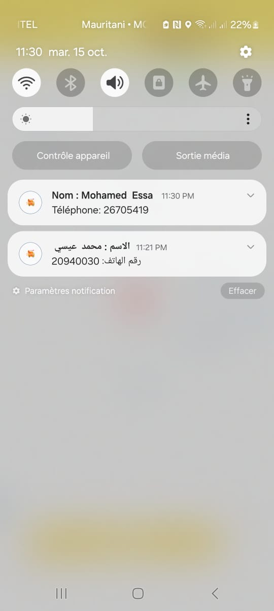
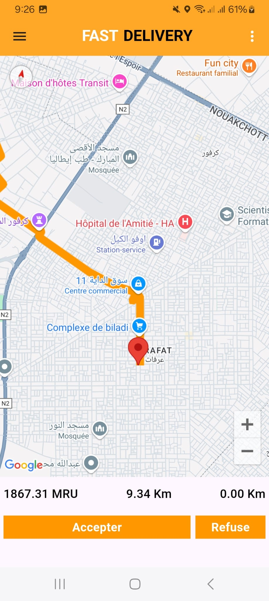
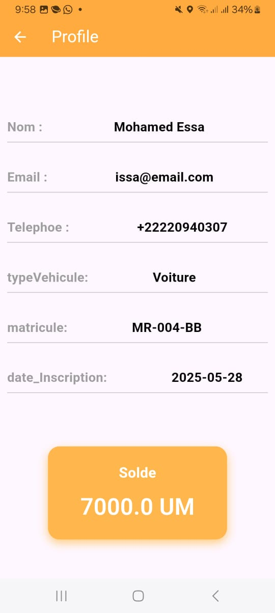
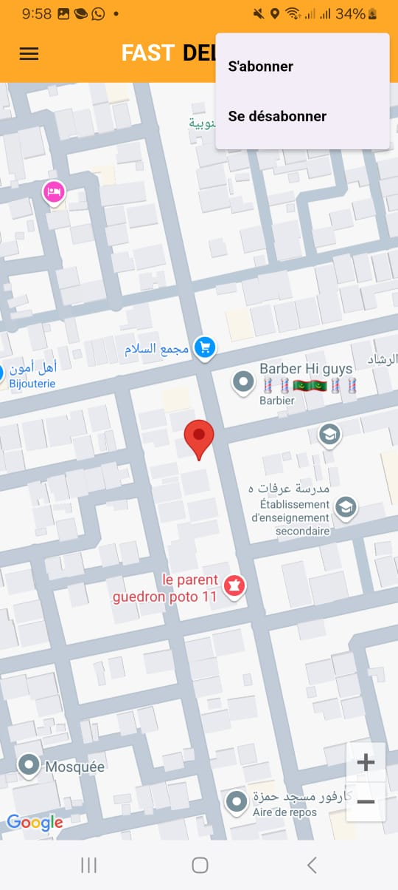

# 🚚 Fast Delivery – Application Livreur

## Description
Fast Delivery est une application mobile destinée aux livreurs, développée avec Flutter, permettant de gérer efficacement les demandes de livraison envoyées par les clients.

Le livreur reçoit des notifications en temps réel avec les informations de livraison et peut accepter ou refuser les demandes en fonction de la distance et du montant proposé.

## 🎓 Contexte
Projet réalisé dans le cadre de ma formation en développement informatique, visant à concevoir un système complet de gestion de livraison avec une application client et une application livreur.

## 🚀 Fonctionnalités principales

- Authentification des livreurs (créés par un administrateur)
- Affichage de la position actuelle du livreur
- Réception des demandes de livraison en temps réel
- Affichage des informations de livraison :
  - Distance entre livreur et client
  - Distance entre livreur et destination
  - Montant à recevoir
- Acceptation ou refus d’une demande
- Gestion du solde du livreur
- Activation / désactivation des notifications

## Technologies utilisées

- Flutter (Frontend mobile)
- Spring Boot (Backend)
- MySQL (Base de données)
- Firebase Cloud Messaging (Notifications)
- Postman (Tests API)  

## Captures d'écran (flow livreur)

  <b>1️- Connexion livreur</b> 
  

  <b>2️- Page d'accueil (position actuelle)</b> 
  

  <b>3️- Réception d'une notification</b> 
  

  <b>4️- Détails de la demande</b> 
  

  <b>6️- Consultation du solde</b> 
  

  <b>7️- Activation ou Désactivation des notifications</b> 
  

## Installation
### 1- Cloner le repository
git clone https://github.com/Mohamedissa282/Fast_Deliver2.git
  - **cd Fast-Delivery**

### 2- Installer les dépendances
  - **flutter pub get**

### 3- Lancer l’application
   - **flutter run**

#  Explications
- **git clone** → récupère le projet depuis GitHub  
- **flutter pub get** → installe toutes les dépendances nécessaires pour Flutter  
- **flutter run** → lance l’application sur ton émulateur ou téléphone  
